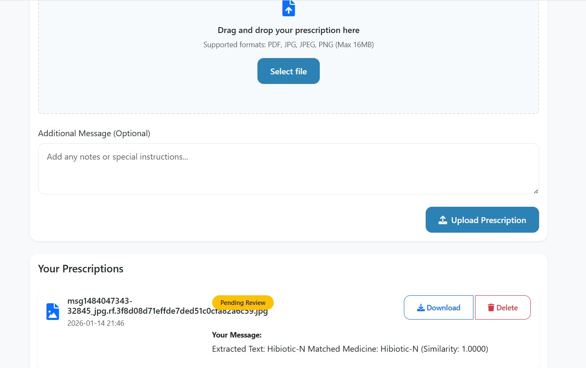
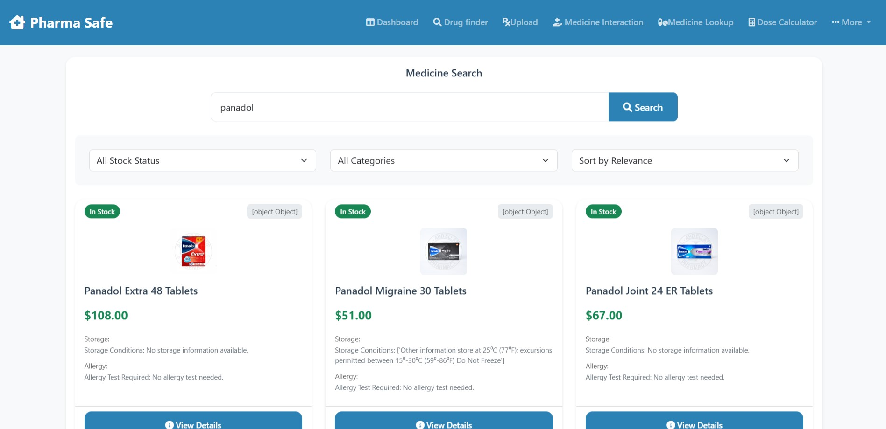
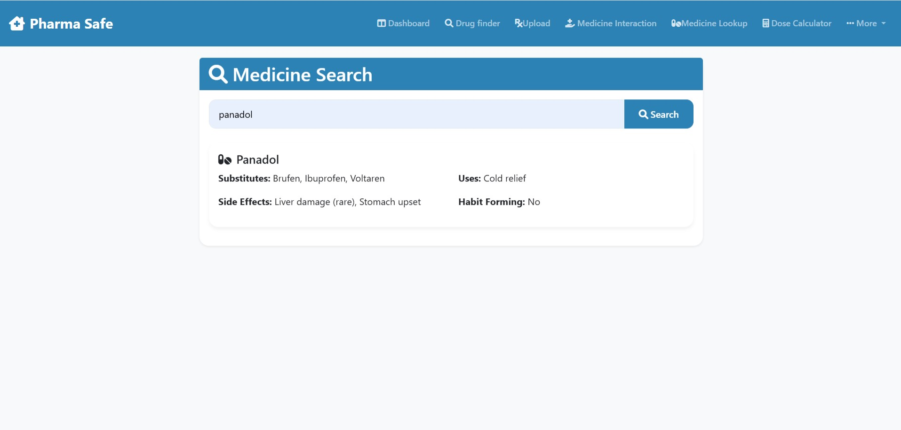
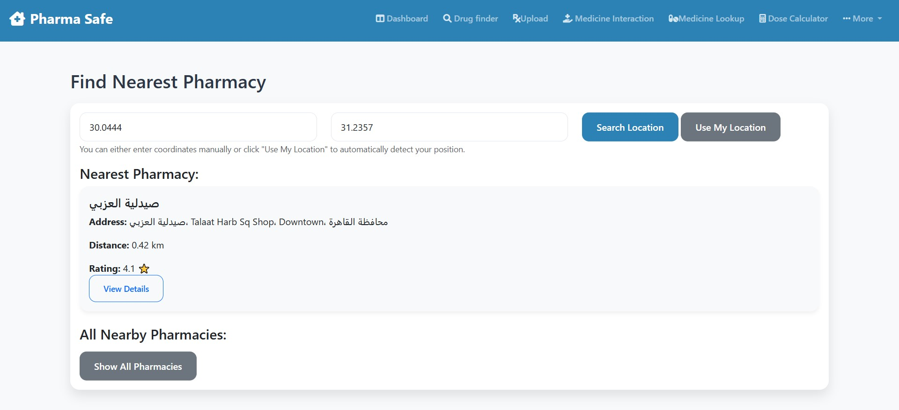

# SmartPharma AI Assistant 

A comprehensive, AI-powered healthcare platform designed to bridge the gap between patients, pharmacists, and medical data. The system integrates a **Hybrid AI Model** for prescription digitization, a **RAG-based medical assistant**, and a robust **Pharmacy Management System**.

It is designed with a **"Safety-First"** architecture, implementing strict human-in-the-loop protocols for medical verification.

---

##  Comprehensive Feature List

### 1.  Core AI & Medical Intelligence
* **Hybrid Prescription Digitization (OCR + Semantic Matching):**
    * Combines **TrOCR (Vision)** for text extraction with **SentenceTransformers (NLP)** for context understanding.
    * **Smart Error Correction:** Automatically corrects OCR misreadings by mapping them to the nearest valid drug name using vector similarity.
    * **Automated Safety Threshold:** Implements a strict **75% confidence threshold**. Results below this accuracy are automatically flagged for manual review by a contracted doctor to ensure zero errors.
* **RAG-Based Medical Condition & Symptom Checker:**
    * **AI Diagnosis Assistant:** Uses **Retrieval-Augmented Generation** to search a verified medical database for symptoms and diseases.
    * **Gemini-Powered Advice:** Synthesizes compassionate, easy-to-understand treatment recommendations and medical advice for patients.



### 2.  Advanced Drug Intelligence & Safety Profile
* **Medicine Lookup & Availability:**
    * **Dual-Engine Search:** Instantly searches both the local inventory and external sources.
    * **Real-Time Stock & Price:** Displays accurate **Price** and **In-Stock** status to prevent ordering unavailable items.
* **Critical Safety Alerts (The "Safety-First" Approach):**
    * ** Allergy Test Warning:** Automatically flags antibiotics and medications that require a mandatory sensitivity test (Allergy Test) before administration.
    * ** Food Interactions:** Provides detailed warnings about foods to avoid while taking specific medications.
    * **Pregnancy Safety:** Explicitly displays pregnancy safety categories and contraindications for expectant mothers.
    * **Storage Instructions:** detailed storage guidelines (e.g., "Keep Refrigerated") extracted via scraping.


### 3.  Medical Interaction Check
* **Drug Interaction Analysis:**
    * The system provides a dedicated interface to analyze potential interactions.
    * It leverages comprehensive scraped data to alert users about **Drug-Food** and **Drug-Condition** interactions, ensuring the patient's holistic safety.

### 4.  Geolocation & Logistics
* **Find Nearest Pharmacy:**
    * **Smart Location Detection:** Detects user location via GPS coordinates.
    * **Proximity Sorting:** Uses `Geopy` and Google Maps logic to calculate the precise Haversine distance to nearby pharmacies, sorting them from nearest to farthest to assist in emergencies.

### 5.  User & Admin Ecosystem
* **Patient Dashboard:** Upload prescriptions, track status (`Pending`, `Approved`, `Needs Review`), and view history.
* **Admin Verification Panel:** A dedicated portal for doctors to review low-confidence prescriptions (<75%) and manage the drug database.

---

## System Architecture & Workflow

1.  **User** uploads a prescription image.
2.  **System** runs TrOCR to extract text.
3.  **NLP Model** compares text with Drug Database.
    * *If Confidence > 75%:* Auto-match & Add to Cart.
    * *If Confidence < 75%:* Route to **Admin Dashboard** for expert verification.
4.  **Admin** reviews flagged items and updates status.
5.  **User** receives full report including **Price**, **Stock**, and **Safety Warnings** (Allergy/Pregnancy).

---

##  Technical Stack

* **Backend:** Flask, SQLAlchemy (SQLite)
* **AI Models:**
    * HuggingFace Transformers (TrOCR, Sentence-MiniLM)
    * Google Gemini API (Generative AI)
* **Utilities:**
    * `GoogleMapspy` & `Geopy` (Location)
    * `Selenium` & `BeautifulSoup` (Data Scraping)
    * `Pillow` (Image Processing)

---

##  Quick Start

### 1. Clone & Install
```bash
git clone https://github.com/AbdelrahmanGamal236/SmartPharma-AI-Assistant.git
cd SmartPharma-AI-Assistant
pip install -r requirements.txt
```

### 2. Configure API Keys
```bash
# Add your Google Gemini API key
export GEMINI_API_KEY="your-api-key-here"
```

### 3. Run the Application
```bash
python app.py
```

### 4. Access the Platform
Open your browser and navigate to `http://localhost:5000`

---

## 🇳️ Workflow Steps

1. **Upload Prescription:** Patient uploads a prescription image
2. **AI Processing:** System digitizes using Hybrid OCR/NLP model
3. **Confidence Check:** If confidence > 75%, auto-process; else flag for review
4. **Doctor Verification:** Medical professionals review low-confidence prescriptions
5. **Full Report:** User receives price, stock, and safety warnings
6. **Find Pharmacy:** Locate nearest pharmacy with real-time inventory

---

##  Contributing

Contributions are welcome! Please follow these steps:

1. Fork the repository and create your branch from `main`
2. Make your changes and ensure code follows project standards
3. Test thoroughly, especially for medical accuracy
4. Submit a pull request with detailed description

---

##  Contact

For inquiries about SmartPharma AI Assistant and its models, please contact:

* **Email**: [Abdelrahman.Gamal.Ai@gmail.com](mailto:Abdelrahman.Gamal.Ai@gmail.com)
* **LinkedIn**: [linkedin.com/in/abdelrahman-gamal236](https://www.linkedin.com/in/abdelrahman-gamal236/)
* **WhatsApp**: +201029744194
* **GitHub**: [@AbdelrahmanGamal236](https://github.com/AbdelrahmanGamal236)
